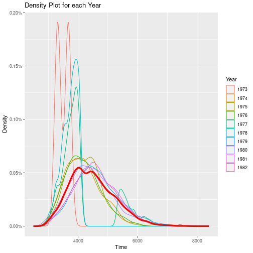
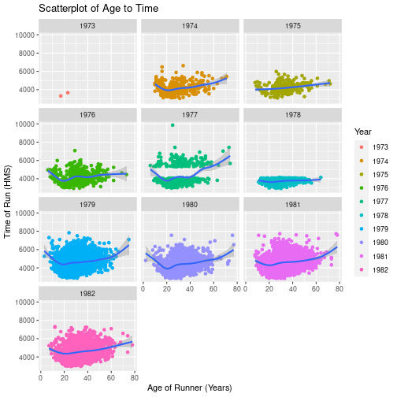
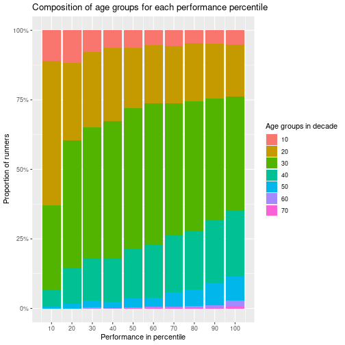

**Complete the following lab as a group. This document should exist in your GitHub repo while you're working on it. Your code should be heavily commented so someone reading your code can follow along easily. See the first code snippet below for an example of commented code.**

**Here's the catch: For any given problem, the person writing the code should not be the person commenting that code, and every person must both code AND comment at least one problem in this lab (you decide how to split the work). This will involve lots of pushing and pulling through Git, and you may have to resolve conflicts if you're not careful! Refer to last Thursday's class notes for details on conflict resolution.**

**ALSO, all plots generated should have labeled axes, titles, and legends when appropriate. Don't forget units of measurement! Make sure these plots could be interpreted by your client.**


# Cherry Blossom Race Plotting Problems

1) Looking at race times all on their own.
    a) Import the data from `CBdata.1_10.RData` and combine all 10 year's worth of data into one data frame, removing observations with missing age or time data (this should be very similar to previous labs). For each year, create a histogram of race times and plot a the corresponding density curve in the same figure. Arrage all ten of these plots into one figure


```r
# creating object 'allData' to hold the cherry blossom data
allData <- bind_rows(CBdata.1_10)
allData <- allData %>%
    mutate(Time = as.numeric(hms(Time)), # setting time and pace as numeric values,
           Pace = as.numeric(ms(Pace))) # using hms() and ms() functions to format them
```

```
## Warning in .parse_hms(..., order = "HMS", quiet = quiet): Some strings failed to
## parse, or all strings are NAs
```

```
## Warning in .parse_hms(..., order = "MS", quiet = quiet): Some strings failed to
## parse, or all strings are NAs
```

```r
allData <- allData %>% filter(!is.na(Age)) # filter out instances where age or time is not entered
allData <- allData %>% filter(!is.na(Time)) # using the filter function

# allData[allData$Time==1973,]

# histogram with density curve
ggplot(allData, aes(x=Time)) + # x axis is the time and y axis is the density of people within that time
  geom_histogram(aes(y=..density.., group=Year)) + # grouping the data by year
  geom_density(aes(group = Year), colour="red") + # have a red line to represent the density curve
  facet_wrap(Year ~., nrow=5, ncol=2, scales = "free") + # facet the data by year
  scale_y_continuous(labels = percent_format(accuracy = 0.01)) +
  ylab("Density")
```

```
## `stat_bin()` using `bins = 30`. Pick better value with `binwidth`.
```


    b) Plot the density curves for all ten years in one figure, along with a density curve of the combined data set (for a total of 11 curves). The main focus should be displaying the combined density, but all 11 densities should be discernible.


```r
allData <- allData %>%
    mutate(Year = as.character(Year)) # changing the year column to characters
# density graph color coded by year
ggplot(allData, aes(x=Time)) + # x axis is runner time and y axis is the density % of that time
  geom_density(aes(group = Year, # grouping by year and having each color of the line represented by year
                   color = Year)) +
  geom_line(stat="density", colour="red", lwd=1.5) +
  xlim(2500,8400) + # zoom-in main part of density plot, discard the tail. 8400 seconds = 2 hours 20 minutes
  scale_y_continuous(labels = percent_format(accuracy = 0.01)) +
  ylab("Density") +
  labs(title="Density Plot for each Year")
```

```
## Warning: Removed 1 rows containing non-finite values (`stat_density()`).
## Removed 1 rows containing non-finite values (`stat_density()`).
```



```r
# ?scale_color_brewer
```


2) Correlating age and time: Create a scatter plot of age and race time, with time being the response. All ten year's worth of data should be included, but you should be able to tell which year each point comes from. Include trend lines for each year, along with a trend line for the combined data set.

```r
ggplot(allData,
       aes(x = Age,
           y = Time)) +
  geom_point(aes(group = Year,
                 color = Year)) +
  geom_smooth(aes(group = Year)) +
  xlab("Age of Runner (Years)") +
  ylab("Time of Run (HMS)") +
  ggtitle("Scatterplot of Age to Time") +
  facet_wrap(Year~., ncol = 3)
```

```
## `geom_smooth()` using method = 'gam' and formula = 'y ~ s(x, bs = "cs")'
```

```
## Warning: Computation failed in `stat_smooth()`
## Caused by error in `smooth.construct.cr.smooth.spec()`:
## ! x has insufficient unique values to support 10 knots: reduce k.
```



Write a short interpretation of the plot as if you were explaining it to your client.

## Explanation of Scatterplot:
```
Here we have a chart that includes the correlation between the age of the runners and how
long it took for them to complete the race. In this case, the amount of time being recorded
is in seconds with the lowest amount of time to complete the race around 2500 seconds and
the most amount of time being around 8400 seconds. Each year is represented by a different color
and also has a blue line which represents about how long it usually takes for a person at that
certain age to finish the race. As we can see from the trends, the fastest times for runners peak
around 20 years of age and slowly get slower as they age. Additionally, children/teens below 20
are also usually slower than those who are in their 20s. Unfortunately, there was a lot of data
that was missing from 1973 in specific due to many participants not recording their ages or times.
```


3) Relating age and times categorically:
We're interested in the age composition for ten performance groups. The performance groups are defined based ten percentiles (10%, 20%,...100%) of relative finish position. For example, someone finishing 3rd out of 125 would be in the 10th-percentile group, while someone finishing 985 out of 1013 would be in the 100th-percentile group.
The age groups we're interested in are defined by decade, so separate people in their 20's from people in their 30's and so forth.
Generate one plot that displays the age composition of each of the ten performance groups. Make sure you're using all ten year's worth of data.
Hint: You can compute performance groups manually from `Year` and `Time`, or by carefully manipulating `Pis/Tis`.


```r
# merge all years into single data frame object
df <- Reduce( function(x,y) merge(x,y,all=TRUE), CBdata.1_10 )

#
df <- df %>%
    rename( age = Age ) %>%
    rename( place = "PiS/TiS" ) %>%
    select(
        -Name,
        -Pace,
        -Division,
        -Hometown,
        -Year,
        -"PiD/TiD",
        -Time) %>%
    mutate( Race = substr( Race, 6, length(Race) ) ) %>%
    filter( Race == "10M" ) %>%
    select( -Race ) %>%
    filter( age != is.nan(age) ) %>%
    filter( age >= 10 )

#
df <- df %>%
    mutate( decade = 10*floor( age/10 ) )

#
df <- df %>%
    mutate( race_size = sapply( strsplit( place, "/" ),
        function(x) as.numeric(x[2]) ) ) %>%
    mutate( place = sapply( strsplit( place, "/" ),
        function(x) as.numeric(x[1]) ) )

# for some reason two of the participants are recorded as
# finishing in (n+1)th place out of n participants... typo?
# these two observations were removed.
print( df %>% filter( place > race_size ) )
```

```
##   age place decade race_size
## 1  73  1466     70      1465
## 2  24   495     20       494
```

```r
df <- df %>%
    filter( place <= race_size )

#
df <- df %>%
    mutate( percentile = 10 * ceiling( 10 * place / race_size ) )

#
df <- df %>%
    mutate( age_percentile_group =
        paste( as.character(decade), as.character(percentile) ) ) %>%
    add_count( age_percentile_group ) %>%
    select( -age_percentile_group ) %>%
    rename( age_percentile_group_count = n )

#
ggplot(
    data = df,
    aes(
        x = percentile,
        y = age_percentile_group_count/1000,
        group = decade,
        fill = decade)
    ) +
    geom_col(aes(fill = decade),
    position = position_stack(reverse = TRUE) ) +
    scale_x_continuous(n.breaks=10) +
    scale_y_continuous(n.breaks=10) +
    xlab("Performance percentile") +
    ylab("Number of participants (thousands)") +
    ggtitle("Perfomance distribution for age groups")
```


